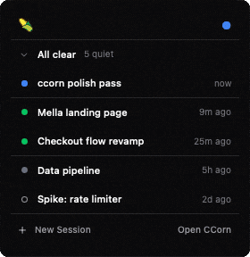
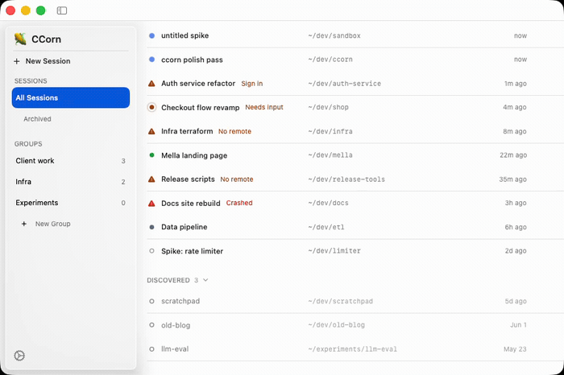

<div align="center">


# CCorn

**Mission control for your Claude Code sessions, right in the macOS menu bar.**

[](LICENSE)
&nbsp;
&nbsp;[](https://github.com/sudoLuko/ccorn/releases)

</div>

If you run several Claude Code sessions at once, you know the feeling: one of them has been blocked on a permission prompt for ten minutes and you had no idea. CCorn starts, watches, and manages [Claude Code](https://claude.com/claude-code) sessions running in tmux, all from a single corn glyph in your menu bar. One look tells you whether anything needs you: a session waiting on permission, a sign-in that expired, a crash. No more cycling through tmux panes to find the one that stalled.

It is a process manager, not a chat interface. You keep talking to Claude in your terminal or at claude.ai/code, and CCorn keeps the fleet running.

## See it in action

<div align="center">



*The menu-bar popover, live. A session goes from working (blue) to needs-input (amber) to crashed (red), then back to calm, and the corn in the menu bar always wears the most urgent state.*

</div>

## What it does

- **Aggregate status in the menu bar.** The corn glyph reflects the most urgent session state across everything it manages.
- **Triage popover.** Sessions that need attention float to the top; calm sessions stay behind a quiet disclosure.
- **Full session manager.** A main window with every session: rename, group, archive, stop, restart, import.
- **One-click handoff.** Open any session in Terminal (it is just a tmux window) or in the browser — a per-session deep link when remote control is active.
- **Discovery.** Finds existing Claude Code sessions on your machine and offers to import and resume them.
- **Notifications.** Get pinged when a session needs your input or dies.

Every session CCorn starts runs `claude --rc` in its own tmux window inside a single `ccorn` tmux session, so sessions survive CCorn restarts, and your terminal is always one `tmux attach` away.

<div align="center">



*The main window. Sessions flip between working, needs-input, and healthy in real time as a new one slides in and an old one is cleared, all in one list with rename, group, archive, stop, restart, and import.*

</div>

## Status colors

Status marks are the only color in CCorn. Every row shows exactly one mark, a colored dot for routine states or a single warning triangle for the broken trio (sign-in, no-remote, crashed). That is the whole product: glance at the colors, know the state.

| Swatch | State | Mark | Label | What it means |
|:------:|-------|:----:|-------|---------------|
|  | **Running** | ● | | Alive, remote control active, healthy |
|  | **Working** | ● | | Claude is executing mid-task |
|  | **Waiting** | ◉ | Needs input | Claude is waiting for input or approval |
|  | **Stale** | ● | | Idle past your threshold |
|  | **Sign in** | ▲ | Sign in | Login prompt is showing; sign-in needed |
|  | **No remote** | ▲ | No remote | Alive, but remote control is not active past the grace period |
|  | **Crashed** | ▲ | Crashed | Process crashed or died unexpectedly |
|  | **Stopped** | ○ | | You stopped it; not running |
|  | **Unmanaged** | ○ | | Discovered on your machine, not yet imported |

The menu-bar corn itself takes on the most urgent state across everything it manages, so the icon alone tells you if anything needs you. Exact light and dark hex for every token lives in [docs/CCORN_SPEC.md](docs/CCORN_SPEC.md), section 3.

## Requirements

- macOS 13 or later
- [tmux](https://github.com/tmux/tmux) (`brew install tmux`)
- [Claude Code CLI](https://claude.com/claude-code) 2.1.51 or later (2.1.110+ for mobile push via Remote Control)

## Install

Download the latest notarized build from [Releases](https://github.com/sudoLuko/ccorn/releases), unzip, drag **CCorn.app** to Applications, and open it. The app is signed and notarized, so it opens without Gatekeeper warnings.

On first launch, CCorn walks you through picking the directories it should watch for sessions.

## Build from source

```sh
brew install xcodegen
git clone https://github.com/sudoLuko/ccorn.git
cd ccorn
xcodegen generate
xcodebuild -project CCorn.xcodeproj -scheme CCorn -configuration Release build
```

The `.xcodeproj` is generated, so edit `project.yml`, not the project file. A full Xcode install is required (Command Line Tools alone will not build the app bundle). Run the tests with `xcodebuild test -project CCorn.xcodeproj -scheme CCorn -destination 'platform=macOS'`.

## Usage

- **New Session.** Pick a folder; CCorn opens a tmux window there and starts `claude --rc` with a title you choose.
- **Import.** Adopt sessions you started yourself; CCorn resumes them under management.
- **Status marks.** A colored dot for routine states, a warning triangle for the broken trio (sign-in needed, remote control unavailable, crashed). See [Status colors](#status-colors) above.
- **Open in Terminal or Browser.** Jump into the live tmux pane, or deep-link to the session in the browser (falling back to the claude.ai/code list if remote control hasn't activated yet).
- **Groups.** Organize sessions into user-defined collections in the sidebar.

## Known limitations

- macOS only, and tmux is required. Sessions live in a tmux session named `ccorn`.
- No chat UI by design. CCorn manages processes; conversations happen elsewhere.
- State detection reads the Claude Code TUI's pane text (polled every 3 seconds), so a CLI update can shift wording before CCorn catches up. The preflight suite in `scripts/preflight/` exists to catch exactly that before releases.
- The App Sandbox is off by design. CCorn spawns `tmux` and `claude`, watches arbitrary directories with FSEvents, and sends AppleEvents to Terminal, none of which a sandboxed app may do.
- "Open in Browser" deep-links to the session via its remote-control bridge id (`claude.ai/code/session_…`); until that id surfaces (remote control still activating), it falls back to the claude.ai/code session list.

## More

- [Full build spec](docs/CCORN_SPEC.md): architecture, design language, every screen and flow.
- [Releasing](RELEASING.md): how maintainers cut a signed, notarized build.

## License

[MIT](LICENSE) — CCorn's source code.

The app icon is the ear-of-corn glyph from [OpenMoji](https://openmoji.org), licensed [CC BY-SA 4.0](https://creativecommons.org/licenses/by-sa/4.0/). Per ShareAlike, the icon artwork (this adaptation) is itself CC BY-SA 4.0; this applies to the image only and does not affect the MIT-licensed code. Details in [design-assets/app-icon/ICON_CREDITS.md](design-assets/app-icon/ICON_CREDITS.md).
