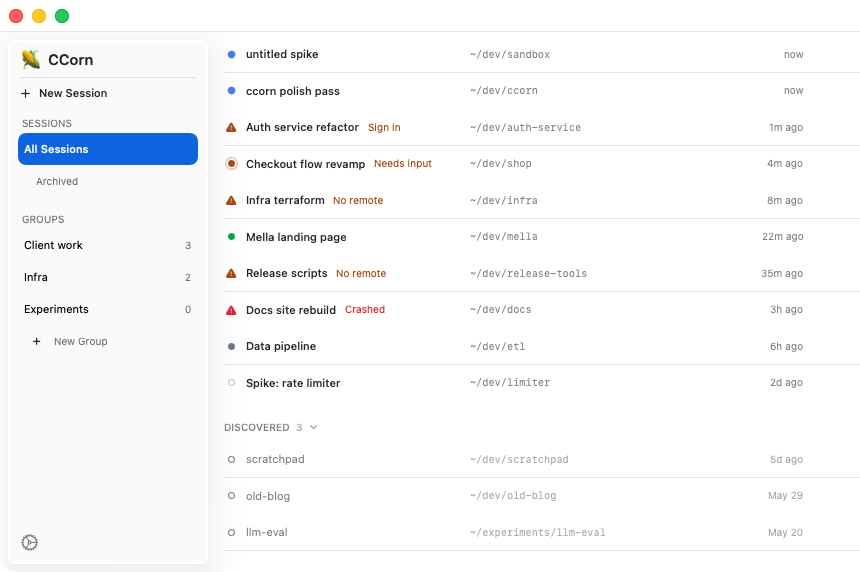
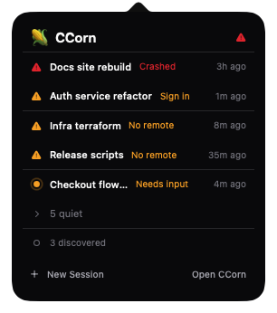

# 🌽 CCorn

**Mission control for your Claude Code sessions, from the macOS menu bar.**

CCorn is a native menu-bar app that starts, watches, and manages [Claude Code](https://claude.com/claude-code) sessions running in tmux. One glance at the corn tells you whether anything needs you: a session waiting on permission, a sign-in that expired, a crash. It is a process manager, not a chat interface — you keep talking to Claude in your terminal or at claude.ai/code; CCorn keeps the fleet running.





## What it does

- **Aggregate status in the menu bar** — the icon reflects the most urgent session state across everything it manages.
- **Triage popover** — sessions that need attention float to the top; calm sessions stay behind a quiet disclosure.
- **Full session manager** — a main window with every session: rename, group, archive, kill, restart, import.
- **One-click handoff** — open any session in Terminal (it's just a tmux window) or in the browser at claude.ai/code.
- **Discovery** — finds existing Claude Code sessions on your machine and offers to import and resume them.
- **Notifications** — get pinged when a session finishes, needs permission, or dies.

Every session CCorn starts runs `claude --rc` in its own tmux window inside a single `ccorn` tmux session, so sessions survive CCorn restarts — and your terminal is always one `tmux attach` away.

<br clear="right">

## Requirements

- macOS 13 or later
- [tmux](https://github.com/tmux/tmux) (`brew install tmux`)
- [Claude Code CLI](https://claude.com/claude-code) 2.1.51 or later (2.1.110+ for mobile push via Remote Control)

## Install

Download the latest notarized build from [Releases](https://github.com/sudoLuko/ccorn/releases), unzip, drag **CCorn.app** to Applications, and open it. The app is signed and notarized, so it opens without Gatekeeper warnings.

On first launch, CCorn walks you through picking the directories it should watch for sessions.

## Build from source

```sh
brew install xcodegen
git clone https://github.com/sudoLuko/ccorn.git
cd ccorn
xcodegen generate
xcodebuild -project CCorn.xcodeproj -scheme CCorn -configuration Release build
```

The `.xcodeproj` is generated — edit `project.yml`, not the project file. A full Xcode install is required (Command Line Tools alone won't build the app bundle). Run the tests with `xcodebuild test -project CCorn.xcodeproj -scheme CCorn -destination 'platform=macOS'`.

## Usage

- **New Session** — pick a folder; CCorn opens a tmux window there and starts `claude --rc` with a title you choose.
- **Import** — adopt sessions you started yourself; CCorn resumes them under management.
- **Status marks** — a colored dot for routine states (working, idle, waiting), a warning triangle for the broken trio: sign-in needed, remote control unavailable, crashed.
- **Open in Terminal / Browser** — jump into the live tmux pane, or open claude.ai/code and find the session by its title.
- **Groups** — organize sessions into user-defined collections in the sidebar.

## Known limitations

- macOS only, and tmux is required — sessions live in a tmux session named `ccorn`.
- No chat UI by design; CCorn manages processes, conversations happen elsewhere.
- State detection reads the Claude Code TUI's pane text (polled every 3 seconds), so a CLI update can shift wording before CCorn catches up. The preflight suite in `scripts/preflight/` exists to catch exactly that before releases.
- The App Sandbox is off by design: CCorn spawns `tmux`/`claude`, watches arbitrary directories with FSEvents, and sends AppleEvents to Terminal — none of which a sandboxed app may do.
- "Open in Browser" lands on the claude.ai/code session list, not a per-session URL (none exists).

## More

- [Full build spec](docs/CCORN_SPEC.md) — architecture, design language, every screen and flow.
- [Runtime findings](docs/RUNTIME_FINDINGS.md) — verified Claude Code CLI behavior the implementation depends on.
- [Releasing](RELEASING.md) — how maintainers cut a signed, notarized build.

## License

[MIT](LICENSE)
